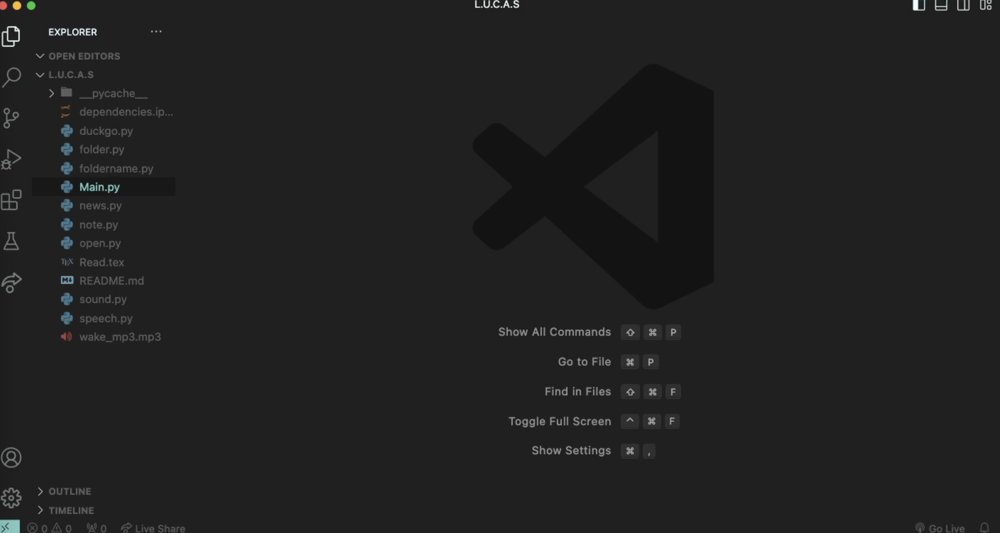

# AI-Mac-Assistant

## Introduction

Hello and welcome to my project! Mac-Assistant is my first GitHub repository, and I'm grateful that you're taking the time to check it out. The code written here is relatively simple. It converts speech input into text that can be passed to Chatgpt 3.5-turbo model, which then outputs the response in speech. However, this assistant has more functionalities than just that. You can use it to create files, search the internet, and even open YouTube and LinkedIn. This is the first version, and I plan to continue adding to this repository in the future so that it can become a fully functional assistant that can help with a variety of tasks.


## Installation and Setup

To begin, you must clone the repo or download the zip file.

```shell
git clone https://github.com/Hanbrar/Mac-Assistant.git
```

Next, you need to install all the necessary dependencies by running the command:

```shell
pip install -r requirements.txt
```

The next step is to go to NewsAPI and OpenAI to get an API key.

- To get a NewsAPI key, you can follow this [article](https://www.educative.io/answers/how-to-get-the-api-key-of-newsapi) using the free version.
- Unfortunately, you must pay for OpenAI, but it is affordable. You can read this [article](https://www.maisieai.com/help/how-to-get-an-openai-api-key-for-chatgpt) to find out how to get an OpenAI API key.

Next, with your NewsAPI and OpenAPI keys, follow the steps in the video below.

[](https://youtu.be/fqhe_YseTJI)

Now, go to the terminal and run the following command:

```shell
python main.py

# or

python3 main.py
```

Please take note of the following instructions. You should notice the word 'Working' displayed in the terminal. Proceed by speaking into your microphone. ChatGPT will respond with an MP3 file using the gTTS library to vocalize its answers. Remember to turn on your volume to hear the responses. Refer to the image below to see a sample conversation.

```markdown
$ python main.py

Working
Done
Recognized Text:
hello
Chat:
Hello, HB! How can I assist you today?

Working
Done
Recognized Text:
who was the first man on the moon
Chat:
The first man on the moon was Neil Armstrong. He took his historic step on the lunar surface on July 20, 1969, as part of the Apollo 11 mission.

Working
Done
Recognized Text:
bye
Chat:
Bye! See you next time.

```

## Note

When running, Apple may ask for your permission to access the microphone for recording. In order to use this code, you must grant permission by saying "yes". You may also see a similar prompt if you want to enable VS Code to access your files and folders. It is essential to grant this permission as the OS library is used to delete and reappear MP3 files containing text-to-speech output. Without this permission, the Mac Assistant will not be able to speak.

